<!--
=====================================================================
 PANDOC BUILD INSTRUCTIONS
 ---------------------------------------------------------------------
 1. Render the PlantUML blocks to images first (recommended), then
    convert to Word:

      pandoc NeuroBuilds_FYP_Phase2.md \
        --filter pandoc-plantuml \
        -o NeuroBuilds_FYP_Phase2.docx \
        --reference-doc=uol-template.docx

 2. If you do not have the pandoc-plantuml filter, paste each diagram's
    PlantUML source into https://www.plantuml.com/plantuml , export the
    PNG, and drop it under the matching Figure caption in Word.

 NOTE ON CHAPTER NUMBERING
 ---------------------------------------------------------------------
 This supplement follows the ORIGINAL 9-chapter UOL template
 (Testing = Ch 5, Tools = Ch 6, Summary = Ch 7, User Manual = Ch 8,
 Lessons & Future Work = Ch 9). Your Phase 1 file places User Manual at
 Chapter 5 — renumber it to Chapter 8 on merge and drop these in as
 5, 6, 7, 9. The Chapter 4 section here supplies diagram sources plus
 detailed descriptions for the figures the Phase 1 design chapter
 references.

 TECH-STACK NOTE (Hybrid framing)
 ---------------------------------------------------------------------
 Phase 1 narrative is preserved but concrete facts match the codebase:
 Python/FastAPI backend (not Node/Express); WhatsApp OTP gateway
 (whatsapp-web.js) under the neutral label "OTP Gateway"; a dedicated
 9-tier deterministic validation_engine.py; and a LangGraph pipeline
 with an explicit deterministic/probabilistic layer split.
=====================================================================
-->

\newpage

# Chapter 4 (Supplement): Design Diagram Sources

This section supplies the **PlantUML source and a detailed description** for every modelled figure referenced by the Phase 1 Design chapter. Each block is self-contained: paste it into any PlantUML renderer (or let `pandoc-plantuml` render it inline) to regenerate the figure. The diagrams reflect the **as-built** architecture — a decoupled React PWA, a FastAPI AI microservice running a LangGraph pipeline, MongoDB Atlas (vector + document store), Firebase (Auth + Firestore + Storage), and the external OTP gateway, Tavily and YouTube Data APIs.

The descriptions are written so they can be read aloud during the viva: each one states **what the diagram shows, why it is structured that way, and which design decision it justifies.**

## 4.0 Use-Case Diagrams (Chapter 3 figures)

### Figure 1 — Aggregated Use Case Diagram

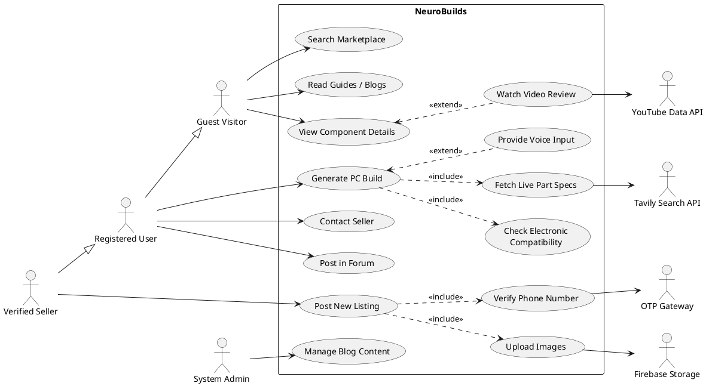

**Description.** This is the system-wide blueprint. Human actors form a **generalization hierarchy**: a *Guest Visitor* has read-only reach (search the marketplace, read guides, view component details); a *Registered User* inherits all of that and gains the interactive core (generate a build, contact sellers, post in the forum); a *Verified Seller* inherits everything a user can do and additionally earns the exclusive right to post listings. The *System Admin* is deliberately kept off the inheritance chain to enforce **separation of duties** — moderation/CMS power is not an "upgraded user", it is a distinct role. The four external actors on the right (Tavily, YouTube, OTP Gateway, Firebase Storage) are *secondary* actors: the system calls them, the user never does directly. The `<<include>>` edges mark mandatory sub-behaviour ("Generate PC Build" always checks compatibility and fetches specs; "Post New Listing" always verifies the phone and uploads images), while `<<extend>>` edges mark optional augmentation (voice input, embedded video). This single diagram justifies the platform's two pillars: **AI-assisted building** and a **trust-gated marketplace**.

### Figure 2 — Use Case: The AI Build Engine

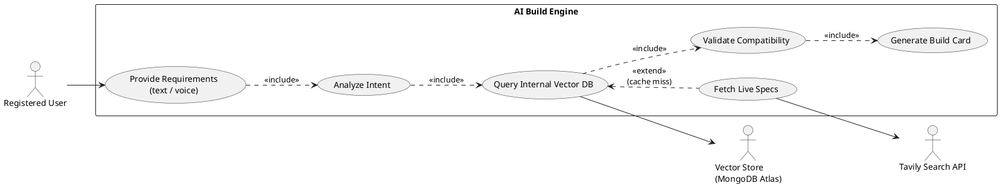

**Description.** This decomposes the headline feature into its **Hybrid RAG** flow. The mandatory spine — *Analyze Intent → Query Vector DB → Validate Compatibility → Generate Build Card* — always executes. The single `<<extend>>` on *Fetch Live Specs* is the crux of the "hybrid" claim: the system only reaches out to Tavily **when the internal vector store misses** (e.g. a part newer than the last ingestion). This keeps the common path fast and offline-resilient while still answering questions about just-released hardware. Note that *Validate Compatibility* is shown as an always-on `<<include>>`, not an optional step — this is the diagram-level expression of the project's safety guarantee: **no build card is ever produced without passing the deterministic compatibility engine first.**

### Figure 3 — Use Case: Marketplace & Security Logic

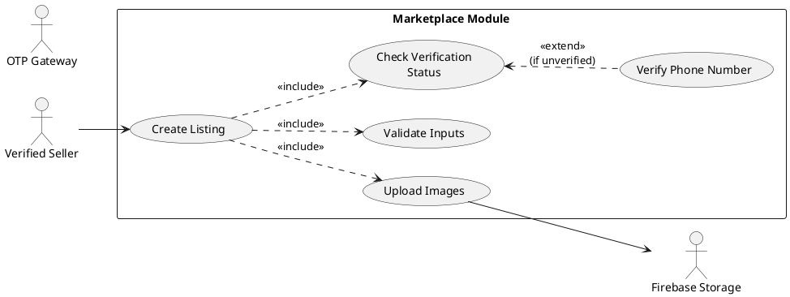

**Description.** This isolates the **fraud-prevention gate** that defines the marketplace. Every *Create Listing* attempt fans out into three mandatory sub-routines: *Check Verification Status* (is this seller trusted?), *Validate Inputs* (no invalid price, no profanity), and *Upload Images* (binary media goes to Firebase Storage, kept separate from the text record). The conditional `<<extend>>` to *Verify Phone Number* fires only when the seller is **not yet verified**, redirecting them into the OTP flow before any listing can persist. Architecturally this diagram explains why image storage is decoupled from the listing document, and why an unverified account can never reach the public grid — the verification check is structurally upstream of persistence.

### Figure 4 — Use Case: Verify Phone Number

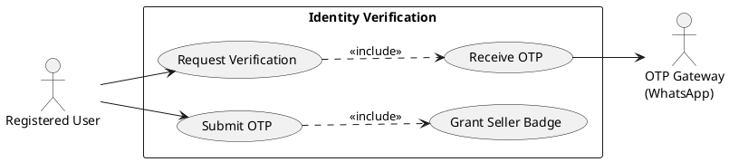

**Description.** A focused view of the **identity loop** that converts a Registered User into a Verified Seller. The user requests verification; the system *includes* "Receive OTP", which is delivered by the WhatsApp OTP gateway (the as-built replacement for a generic SMS gateway); the user submits the code; and a correct submission *includes* "Grant Seller Badge". The two-step request/submit split is intentional — it models the asynchronous round-trip through an external channel and is exactly the boundary at which the system can fail safely (wrong/expired code simply never reaches the badge step).

### Figure 5 — Use Case: View Component Reviews

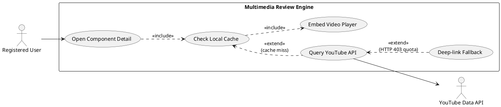

**Description.** This models the **cache-first review pipeline** that keeps the system inside the YouTube Data API's 10,000-unit/day quota. Opening a component detail *always* checks the local cache first; an external API call is an `<<extend>>` that only happens on a cache miss. A second `<<extend>>` — *Deep-link Fallback* — is the resilience path: if YouTube returns HTTP 403 (quota exhausted), the system degrades to a plain external search link instead of crashing. The diagram therefore encodes two non-functional requirements directly into behaviour: **API-cost discipline** and **graceful degradation**.

### Figure 6 — Use Case: Manage Blog Content

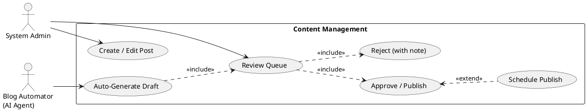

**Description.** The CMS use case shows **two authors and one gate**. A human admin authors and reviews; an AI *Blog Automator* (an Actor-Critic agent) can auto-generate a draft. Crucially, the automator's output is not published directly — *Auto-Generate Draft* `<<include>>`s the same *Review Queue* a human post must pass through. This **human-in-the-loop checkpoint** is the safety mechanism that lets the platform use AI-written content without surrendering editorial control. *Approve/Publish* optionally extends into *Schedule Publish* for future-dated posts.

\newpage

## 4.1 Figure 7 — Architecture Diagram

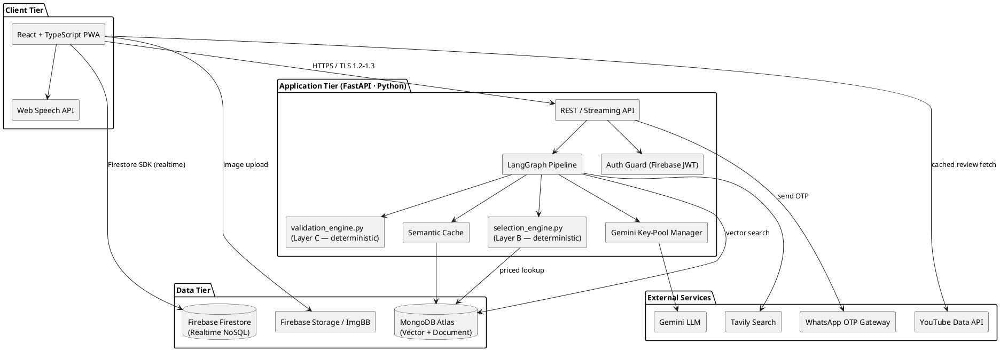

**Description.** The system is a **four-tier, polyglot, decoupled architecture**. The *Client Tier* is a single-page React/TypeScript PWA that talks to two backends in parallel: it streams AI requests to FastAPI over HTTPS, and it speaks **directly** to Firebase Firestore via the realtime SDK for all live social data (chat, threads, listings) — this dual-path design is why the marketplace and community feel instant without polling the Python service. The *Application Tier* is the AI brain: a LangGraph pipeline flanked by the two deterministic engines (Layers B and C), the Gemini key-pool manager, the semantic cache, and a Firebase-JWT auth guard. The *Data Tier* splits storage by access pattern — **MongoDB Atlas** holds vectors and the hardware catalogue (semantic search), while **Firestore** holds realtime social documents. The *External Services* are isolated behind the application tier so quota limits, rate limits and outages are absorbed centrally. The single most important reading of this diagram: **the LLM (top-right) is reached only through the key-pool manager and only for narration/intent — every box labelled "deterministic" sits on a separate path that never touches it.**

## 4.2 Figure 8 — Entity Relationship Diagram

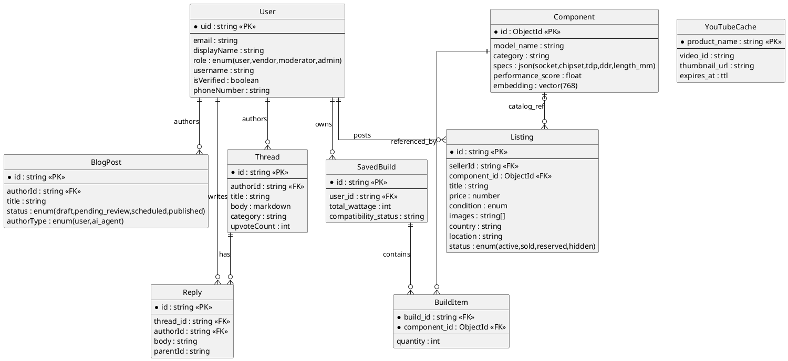

**Description.** The ERD captures the platform's **dual-store reality** in one logical model. `User` is the hub: it owns saved builds and authors every kind of user content (listings, threads, replies, blog posts) — all 1:N. The two most important structural decisions are visible here. First, **`BuildItem` is an associative (bridge) entity** resolving the many-to-many relationship between `SavedBuild` and `Component`; deleting a build cascade-deletes its items, but never the underlying catalogue component. Second, the `Component ↔ Listing` relationship is **optional (`|o`)** — a seller *may* link a listing to the official catalogue to auto-populate trustworthy specs, but a listing can also stand alone. Attribute-level notes worth narrating: `Component.embedding` is the 768-dimension vector that powers semantic RAG search; `User.role` drives RBAC and is immutable to non-admins; `Listing.status='hidden'` is the moderation flag; `BlogPost.authorType` distinguishes human from AI-agent authorship; and `YouTubeCache.expires_at` is a **TTL index** that mechanically enforces the 7-day caching constraint at the database level rather than in application code.

**Data dictionary (key tables).** `User.role` drives RBAC and is immutable to non-admins (enforced in `firestore.rules`). `Listing.status='hidden'` is set by moderation. `BuildItem` is the M:N bridge between `SavedBuild` and `Component`; deleting a build cascade-deletes its items. `YouTubeCache.expires_at` is a TTL index enforcing the 7-day caching constraint.

## 4.3 Data Flow Diagrams

### Figure 10 — DFD Level 0 (Context)

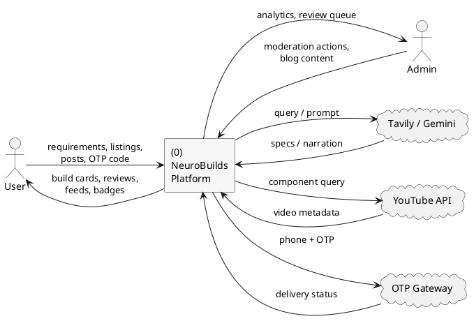

**Description.** The context (Level 0) diagram collapses the whole platform into a **single process** and shows only what crosses the system boundary. Two human external entities (User, Admin) and three external service clouds (Tavily/Gemini for reasoning, YouTube for reviews, OTP Gateway for verification) exchange labelled data flows with the system. This is the highest-altitude view: it deliberately hides *how* the system works and shows only *what goes in and what comes out* — user requirements in, build cards out; admin moderation in, analytics out. It establishes the scope boundary that every lower-level DFD must decompose without adding new external interfaces.

### Figure 11 — DFD Level 1

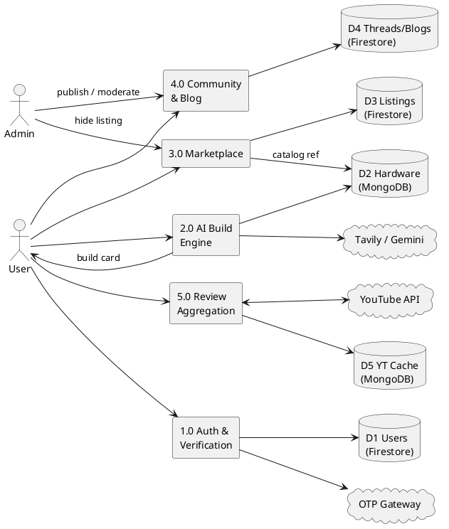

**Description.** Level 1 explodes the single Level-0 process into **five cooperating processes** and exposes the **five data stores** behind them, making the dual-database strategy explicit: D1/D3/D4 live in Firestore (realtime social data), while D2/D5 live in MongoDB (hardware vectors + review cache). The diagram shows the cross-store link that matters most — process *3.0 Marketplace* reads D3 (its own listings) **and** D2 (the hardware catalogue) to offer catalogue-linked listings. It also shows that the Admin only interacts with processes 3.0 and 4.0 (moderation and content), never with the AI engine, reinforcing the separation-of-duties seen in the use cases. Conservation of flow is preserved: every external interface from Level 0 reappears here, just attached to the specific process that owns it.

## 4.4 Figure 12 — Class Diagram

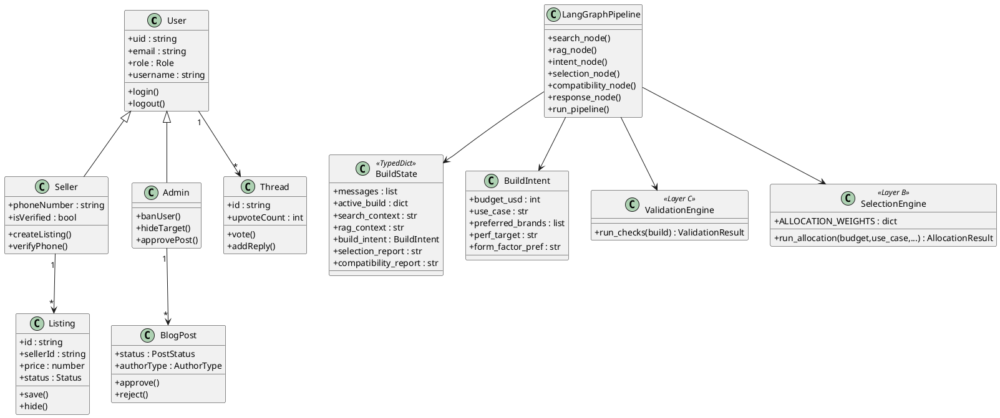

**Description.** The class diagram has two clusters. The **domain/RBAC cluster** (`User → Seller → Admin` via inheritance, plus `Listing`, `Thread`, `BlogPost`) models identity and content ownership — `Seller` adds verification state and listing creation, `Admin` adds privileged moderation operations. The **AI-pipeline cluster** is the technically distinctive part: `LangGraphPipeline` orchestrates six node-methods over a single shared `BuildState` (a TypedDict that threads context between nodes). It depends on `BuildIntent` (the structured output of the LLM intent node) and on the two **stereotyped deterministic classes** — `ValidationEngine <<Layer C>>` and `SelectionEngine <<Layer B>>`. The stereotypes are not decoration: they document the architectural contract that these classes contain **all** arithmetic and rule logic and expose pure functions (`run_checks`, `run_allocation`) with **no LLM dependency**. This is the object-level statement of the deterministic/probabilistic split.

**Description of system classes.** `User`→`Seller`→`Admin` form the RBAC hierarchy. `LangGraphPipeline` orchestrates the six nodes over a shared `BuildState`; the deterministic `ValidationEngine` (Layer C) and `SelectionEngine` (Layer B) are pure-Python and never call the LLM, which is the core architectural guarantee narrated by `response_node` (Layer D).

## 4.5 Activity Diagrams

### Figure 13 — Activity: Create Account

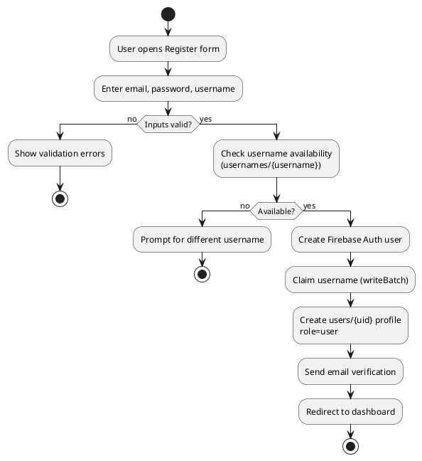

**Description.** Registration is modelled as a **two-gate guarded flow**. The first decision validates form input; the second checks username uniqueness against the `usernames/{username}` shadow index *before* any account is created. Only when both gates pass does the system perform the atomic sequence — create the Auth user, **claim the username via a Firestore `writeBatch`** (so the username index and the profile are written together or not at all), seed the `users/{uid}` profile with the default `role=user`, and dispatch email verification. The diagram's value is showing that username claiming is atomic and pre-creation, which is how the system prevents two accounts racing for the same handle.

### Figure 14 — Activity: Generate PC Build

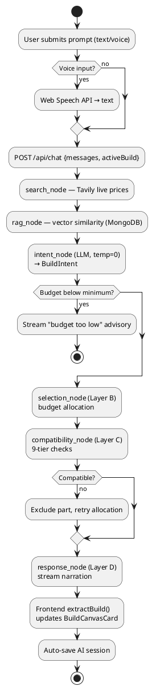

**Description.** This is the end-to-end choreography of the flagship feature, and it visibly maps onto the **six LangGraph nodes**. Optional speech-to-text feeds the prompt; the request then flows through search (live prices) and RAG (vector recall) before the LLM intent node converts free text into a structured `BuildIntent` at **temperature 0** (the anti-hallucination setting). A guard rejects sub-threshold budgets early. The core loop is the **retry feedback edge**: if the deterministic compatibility node (Layer C) rejects the allocator's choice (Layer B), the offending part is blacklisted and allocation re-runs — a self-correcting loop that converges on a valid build *without* asking the LLM to fix anything. Only after a compatible build exists does Layer D narrate it as a token stream, which the frontend parses (`extractBuild`) into the live BuildCanvasCard and auto-saves as a session.

### Figure 15 — Activity: Create Marketplace Listing

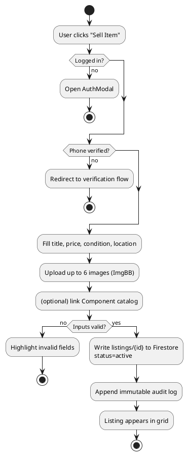

**Description.** The listing flow front-loads **three guards in priority order** — authentication, then phone verification, then input validation — so a request is rejected at the earliest possible point and never wastes work (e.g. an unverified user is bounced before they can upload images). The happy path persists the listing as `status=active` and, importantly, **appends an immutable audit-log entry** (user ID, timestamp, IP) in the same step; this is the data trail the constraints section promises for fraud investigation. The optional catalogue-link activity is where a seller can attach verified specs, tying back to the optional `Component ↔ Listing` relationship in the ERD.

### Figure 16 — Activity: Phone Verification

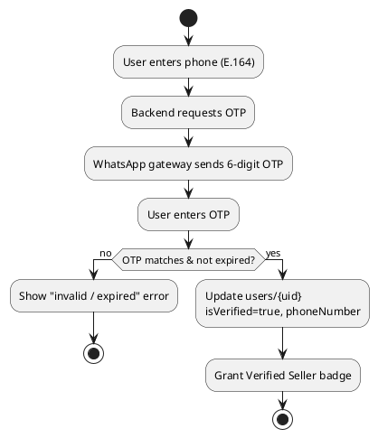

**Description.** Verification is a single-decision flow whose guard checks **both correctness and freshness** (matches *and* not expired) — the expiry clause is what stops an intercepted or reused code from succeeding. A pass writes `isVerified=true` and the phone number onto the user profile and grants the seller badge; a fail loops the user back with an error and changes no state. Modelling the external send as its own activity ("WhatsApp gateway sends OTP") makes the trust boundary explicit: the secret travels through a third-party channel the system does not control, so the verifying comparison happens server-side on return.

## 4.6 Sequence Diagrams

### Figure 17 — Sequence: Create Account (overview)

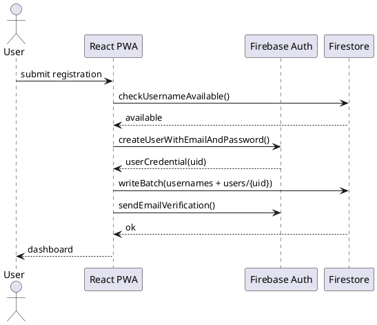

**Description.** The sequence makes the **temporal ordering** of registration explicit, which the activity diagram only implies: the username availability read happens *before* the Auth account is created, and the `writeBatch` that writes both the `usernames/{username}` index and the `users/{uid}` profile happens *after* the Auth UID exists (because the profile keys on that UID). Reading the lifelines left to right, the client (PWA) is the orchestrator — Firebase Auth and Firestore are independent services it coordinates, which is why this logic lives client-side with security enforced by `firestore.rules` rather than in a custom server.

### Figure 18 — Sequence: Phone Verification

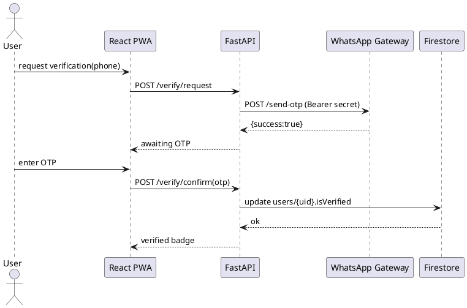

**Description.** Unlike registration, verification is **server-mediated**: the FastAPI backend sits between the client and the WhatsApp gateway, and the call to the gateway carries a **`Bearer` shared secret** so only the trusted backend can trigger OTP sends. The diagram shows the deliberate two-request shape (`/verify/request` then `/verify/confirm`) separated by the out-of-band delivery — this is the asynchronous gap from the activity diagram drawn on a timeline. The Firestore write that flips `isVerified` happens only inside the confirm leg, server-side, after the code check.

### Figure 19 — Sequence: Create Marketplace Listing

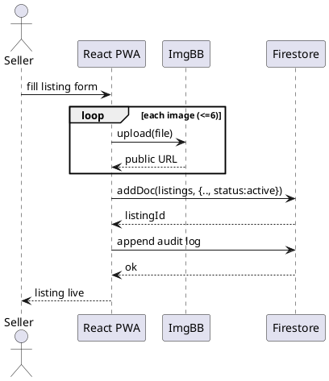

**Description.** The key detail here is the **`loop` fragment**: images are uploaded to ImgBB one at a time (up to six), and only their returned public URLs — not the binary files — are stored in the Firestore listing document. This is the sequence-level expression of the architectural decision to **keep heavy media off the realtime database**. After the listing is created and its ID returned, a second write appends the audit log, matching the immutable-trail requirement from the activity flow.

### Figure 20 — Sequence: Generate AI PC Build

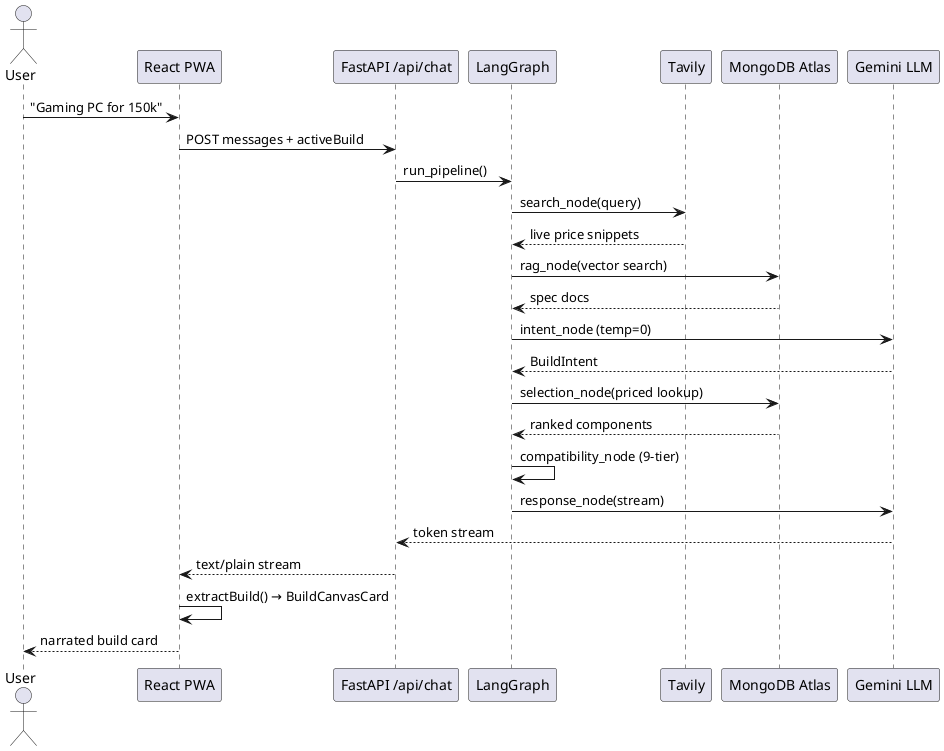

**Description.** This is the most important sequence in the project. Reading the Gemini LLM lifeline, notice it is touched **exactly twice** — once to parse intent and once to narrate — and that the `compatibility_node` is a **self-message on LangGraph** (`G -> G`), i.e. pure in-process Python with no external participant. MongoDB is consulted twice (vector recall, then priced selection), and Tavily once for live pricing. The response leg is drawn as a **token stream** back through FastAPI (`text/plain`) to the client, where `extractBuild()` incrementally updates the BuildCanvasCard. The diagram is the runtime proof of the central thesis: **expensive, hallucination-prone LLM calls bracket the flow, but the decision that determines whether a build is safe happens entirely off the LLM lifeline.**

## 4.7 Figure 21 — Collaboration Diagram (Generate AI Build)

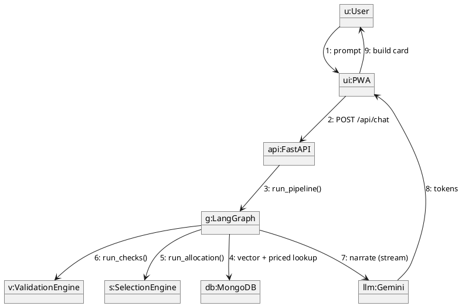

**Description.** The collaboration diagram conveys the **same interaction as Figure 20 but emphasises object structure over time** — the numbered messages (1–9) encode the call order. It is the clearest single picture of *who collaborates with whom*: LangGraph (`g`) is the central coordinator that fans out to four collaborators — the database, the selection engine, the validation engine, and the LLM — and the LLM streams back to the UI directly. Placing `v:ValidationEngine` and `s:SelectionEngine` as first-class objects beside `llm:Gemini` visually reinforces that they are **peers of the LLM in the collaboration, not subordinate to it**.

## 4.8 State Transition Diagrams

### Figure 22 — State: AI Build Session (overview)

```plantuml
@startuml fig22_state_session
skinparam shadowing false
[*] --> Idle
Idle --> Streaming : sendMessage()
Streaming --> BuildExtracted : json block parsed
Streaming --> MockFallback : service timeout (10s)
MockFallback --> BuildExtracted
BuildExtracted --> Saved : auto-save session
Saved --> Idle : new session
Saved --> [*]
@enduml
```

**Description.** This models the **resilience contract** of a chat session. From `Streaming` there are two exits: the normal one parses a JSON build block into `BuildExtracted`, and the failure one — a 10-second service timeout — routes into `MockFallback`, which **still converges on `BuildExtracted`**. That convergence is the point: whether the live backend answers or not, the user always reaches a usable build and a saved session, so the UI never dead-ends. The `Saved → Idle` loop models "New Session" without leaving the page.

### Figure 23 — State: User Account (Identity & Verification)

```plantuml
@startuml fig23_state_user
skinparam shadowing false
[*] --> Guest
Guest --> Registered : register()
Registered --> EmailPending : sendEmailVerification()
EmailPending --> Registered : verified
Registered --> OTPSent : requestPhoneVerify()
OTPSent --> VerifiedSeller : OTP correct
OTPSent --> Registered : OTP failed / expired
VerifiedSeller --> Suspended : admin ban
Suspended --> VerifiedSeller : admin reinstate
VerifiedSeller --> [*]
@enduml
```

**Description.** The account lifecycle shows **two independent verification axes** (email and phone) and an administrative override. The `OTPSent` state has a self-protecting pair of edges — success promotes to `VerifiedSeller`, while *failed or expired* falls back to `Registered` with no privilege gained, which is the state-machine encoding of "a bad OTP must never grant the badge." The `VerifiedSeller ⇄ Suspended` cycle gives admins reversible enforcement (ban then reinstate) without destroying the account, supporting the moderation and audit requirements.

### Figure 24 — State: Community Forum (Post Lifecycle)

```plantuml
@startuml fig24_state_thread
skinparam shadowing false
[*] --> Active : createThread()
Active --> Active : vote / reply
Active --> Solved : author marks solved
Active --> Hidden : moderator hides
Solved --> Active : reopen
Hidden --> Active : moderator restores
Solved --> [*]
Hidden --> [*]
@enduml
```

**Description.** A thread is born `Active` and most interactions (votes, replies) are **self-transitions** that change content without changing lifecycle state. Two role-gated transitions diverge from `Active`: the **author** can mark a thread `Solved`, while a **moderator** can move it to `Hidden`. Both target states are reversible (`reopen`, `restore`), which keeps moderation non-destructive and matches the fine-grained update rules in `firestore.rules` (authors edit content/solve; moderators control visibility).

### Figure 25 — State: Marketplace Listing (Item Lifecycle)

```plantuml
@startuml fig25_state_listing
skinparam shadowing false
[*] --> Active : createListing()
Active --> Reserved : buyer commits
Reserved --> Sold : transaction done
Reserved --> Active : deal fell through
Active --> Hidden : moderation
Hidden --> Active : restored
Active --> Sold : direct sale
Sold --> [*]
@enduml
```

**Description.** The listing lifecycle captures real trading dynamics, including the **reversible `Reserved` state** — a buyer can commit (taking the item off the open market) and then back out, returning it to `Active` rather than forcing a sale. `Sold` is reachable both through reservation and directly, modelling quick in-person deals. `Hidden` is the moderation branch and, like the thread diagram, it is reversible. `Sold` is the only terminal state, which is what lets the dashboard cleanly separate live inventory from completed trades.

## 4.9 Figure 26 — Component Diagram

```plantuml
@startuml fig26_component
skinparam shadowing false
skinparam componentStyle rectangle

component "Frontend (Vite/React/TS)" {
  [Pages & Routing]
  [Hooks (useAIAssistant, useMarketplace, ...)]
  [telemetryTracker.ts]
  [Service Worker (PWA)]
}

component "AI Microservice (FastAPI)" {
  [main.py (routes)]
  [agent.py (LangGraph)]
  [validation_engine.py]
  [selection_engine.py]
  [location_search.py]
  [cache_manager.py]
  [gemini_manager.py]
  [routers/blog_automator.py]
  [services/auth_guard.py]
}

component "OTP Gateway (Node)" {
  [whatsapp-web.js]
}

database "MongoDB Atlas"
database "Firebase (Auth/Firestore/Storage)"
cloud "Gemini / Tavily / YouTube"

[Hooks (useAIAssistant, useMarketplace, ...)] --> [main.py (routes)] : HTTPS
[Hooks (useAIAssistant, useMarketplace, ...)] --> "Firebase (Auth/Firestore/Storage)"
[main.py (routes)] --> [agent.py (LangGraph)]
[agent.py (LangGraph)] --> "MongoDB Atlas"
[agent.py (LangGraph)] --> "Gemini / Tavily / YouTube"
[main.py (routes)] --> [whatsapp-web.js] : Bearer
[routers/blog_automator.py] --> "Firebase (Auth/Firestore/Storage)"
@enduml
```

**Description.** The component diagram maps the logical architecture onto **actual source artifacts**, so it doubles as a navigation guide to the repository. Three deployable components are shown: the React frontend (pages, hooks, the telemetry tracker, the PWA service worker), the FastAPI microservice (with every key module named — the LangGraph agent, both deterministic engines, geo-search, cache, key manager, blog automator and auth guard), and the standalone Node OTP gateway. The wiring confirms two earlier claims at the file level: the frontend hooks reach Firebase **directly** (bypassing FastAPI) for realtime data, and the OTP gateway is reached only over a **Bearer-authenticated** link from `main.py`. It is the bridge between the design chapter and the codebase an examiner will open.

## 4.10 Figure 27 — Deployment Diagram

```plantuml
@startuml fig27_deployment
skinparam shadowing false

node "User Device" {
  artifact "Browser / Installed PWA"
}
node "Static Host (CDN)" {
  artifact "React build (HTML/JS/CSS)"
}
node "App Server" {
  artifact "FastAPI (uvicorn)"
  artifact "LangGraph pipeline"
}
node "OTP Host" {
  artifact "WhatsApp Gateway (Node)"
}
cloud "MongoDB Atlas" {
  database "vector + document store"
}
cloud "Google Firebase" {
  database "Auth / Firestore / Storage"
}
cloud "Third-Party APIs" {
  artifact "Gemini / Tavily / YouTube"
}

"Browser / Installed PWA" --> "React build (HTML/JS/CSS)" : HTTPS
"Browser / Installed PWA" --> "FastAPI (uvicorn)" : HTTPS/TLS
"Browser / Installed PWA" --> "Auth / Firestore / Storage" : SDK
"FastAPI (uvicorn)" --> "vector + document store"
"FastAPI (uvicorn)" --> "Gemini / Tavily / YouTube"
"FastAPI (uvicorn)" --> "WhatsApp Gateway (Node)" : Bearer
@enduml
```

**Description.** The deployment diagram shows the **physical distribution of artifacts across nodes** and the protocols between them. The browser/PWA node fans out to three independent endpoints — the CDN for static assets, the FastAPI app server for AI work, and Firebase directly for auth and realtime data — which is why a Firebase or CDN outage does not take down the AI service and vice versa. The OTP gateway is intentionally a **separate host** (it must hold a long-lived WhatsApp session via Puppeteer and survive restarts independently of the stateless API). The cloud nodes (MongoDB Atlas, Firebase, third-party APIs) are managed services, so the diagram also implicitly documents the project's reliance on provider SLAs and the free-tier limits called out in the constraints. This view is what governs performance, scalability, maintainability and portability for the system.

\newpage

# Chapter 5: Testing

## 5.1 Test Case Specifications

Testing follows a layered strategy aligned to the system's deterministic/probabilistic split. The **deterministic** engines (`validation_engine.py`, `selection_engine.py`) are verified by an automated, network-free **academic evaluation suite** (`backend/tests/evaluation_suite.py`). The **probabilistic** AI narration and the **UI/integration** paths are verified through manual functional and black-box test cases. This separation matters: deterministic code can be held to exact pass/fail numbers (Section 5.3), whereas the LLM's prose output is judged on whether it faithfully relays those numbers rather than on exact string matching. The two representative login cases below follow the required template.

**Positive Test Case**

| Field | Detail |
|---|---|
| ID | TC_LOGIN_SUCCESS |
| Priority | High |
| Description | Verify user authentication via Firebase Auth. |
| Reference | FR (User Management & Authentication) |
| Users | Registered User |
| Pre-requisites | (A) System online (B) Valid credentials exist (C) Internet access |
| Steps | (A) Open app (B) Enter email (C) Enter password (D) Click Login |
| Input | Valid email + password |
| Expected result | Authenticated; dashboard renders with session. |
| Status | Tested, passed. |

**Negative Test Case**

| Field | Detail |
|---|---|
| ID | TC_LOGIN_FAILURE |
| Priority | High |
| Description | Verify rejection of invalid credentials. |
| Reference | FR (User Management & Authentication) |
| Users | Registered User |
| Pre-requisites | (A) System online (B) Internet access |
| Steps | (A) Open app (B) Enter email (C) Enter wrong password (D) Click Login |
| Input | Incorrect / deactivated credentials |
| Expected result | Access denied; Firebase error surfaced inline; no session created. |
| Status | Tested, passed. |

**Domain-specific functional test cases (selected).** These exercise each functional requirement from Chapter 2 directly, including the safety-critical compatibility rejections and the quota fallback:

| ID | Linked FR | Input | Expected Result | Status |
|---|---|---|---|---|
| TC_BUILD_GEN | FR_01 | "Gaming PC for 150k" | Streamed, narrated build card with CPU/GPU/MB/RAM/PSU + price | Passed |
| TC_COMPAT_SOCKET | FR_02 | AM5 CPU + AM4 board | FAIL flagged: "socket mismatch" | Passed |
| TC_COMPAT_PSU | FR_02 | RTX 4090 + 450W PSU | FAIL flagged: PSU transient margin | Passed |
| TC_LISTING_UNVERIFIED | FR_03 | Unverified user posts listing | Blocked; redirected to verification | Passed |
| TC_OTP_VALID | FR_04 | Correct 6-digit OTP | Verified Seller badge granted | Passed |
| TC_OTP_INVALID | FR_04 | Wrong/expired OTP | Rejected with error | Passed |
| TC_YT_QUOTA | FR_05 | YouTube HTTP 403 | Graceful deep-link fallback (no crash) | Passed |
| TC_POST_MD | FR_06 | Markdown thread body | Rendered post in correct category feed | Passed |

## 5.2 Black Box Test Cases

Black-box testing treats each module as opaque, exercising inputs/outputs without knowledge of internal structure. It targets the classic defect categories: missing/incorrect functions, interface errors, data-structure or external-DB access errors, behavioural/performance errors, and initialization/termination errors. The techniques below were applied to the highest-risk inputs in the system — listing creation, the AI budget threshold, and the verification gate.

### 5.2.1 Equivalence Partitions (EP) — Marketplace Listing Price

The input domain is divided into classes that should be treated identically, so one representative per class suffices:

| Variable | Valid Classes | Invalid Classes |
|---|---|---|
| Price | (1) Positive number ≤ 10,000,000 (2) Integer or 2-dp decimal | (1) Negative / zero (2) Non-numeric text (3) Empty field |
| Title | (1) 5–120 characters | (1) < 5 chars (2) Empty (3) Profanity-flagged |
| Images | (1) 1–6 JPEG/PNG files | (1) 0 images (2) > 6 images (3) Non-image MIME |

### 5.2.2 Boundary Value Analysis — AI Budget Threshold

Defects cluster at partition edges, so each boundary is tested on both sides:

| Boundary | Input (PKR) | Expected |
|---|---|---|
| Below min | 29,999 | Rejected: "budget too low" |
| At min | 30,000 | Accepted (minimal build) |
| Nominal | 150,000 | Accepted (balanced build) |
| Upper practical | 1,000,000 | Accepted (enthusiast build) |
| OTP length | 5 / 6 / 7 digits | Only 6 digits accepted |

### 5.2.3 Decision Table Testing — Listing Creation Authorization

The three-guard authorization logic from Figure 15 is enumerated as a decision table to guarantee every reachable branch is covered:

| Logged in? | Phone verified? | Inputs valid? | Action |
|---|---|---|---|
| No | – | – | Open AuthModal |
| Yes | No | – | Redirect to verification |
| Yes | Yes | No | Show field errors |
| Yes | Yes | Yes | Create listing (active) |

### 5.2.4 State Transition Testing

Validated against Figures 23–25. Valid sequences such as `Guest → Registered → OTPSent → VerifiedSeller` were driven to completion, and **invalid transitions were confirmed to be unreachable**: an `OTPSent → VerifiedSeller` move with a wrong OTP must *not* fire (it falls back to `Registered`), and a `Sold → Active` move on a listing is rejected because no such edge exists. Testing the *absence* of illegal edges is as important as testing the legal ones.

### 5.2.5 Use Case Testing

Each Chapter 3 use case (UC-01 … UC-05) was executed end-to-end **including its alternate flows** — for example UC-01 A1 (vector miss → Tavily fallback) and A2 (sub-threshold budget). All basic and alternate flows produced the documented post-conditions, confirming the use-case model and the implementation agree.

## 5.3 White Box Test Cases

White-box testing derives cases from internal logic. The deterministic engines are the primary white-box target because their branches are fully enumerable and individually labelled, which makes path coverage measurable rather than approximate.

### 5.3.1 Cyclomatic Complexity

`validation_engine.run_checks()` implements nine independent check tiers (PSU transient margin, CPU↔MB socket, BIOS-flash advisory, RAM DDR type, form-factor fit, GPU clearance, cooler clearance, bottleneck, upgrade path). Treating each tier as a binary decision plus the aggregation node gives an approximate cyclomatic complexity of **V(G) ≈ 10** — ten linearly independent paths. A lower cyclomatic number means lower modification risk and easier comprehension; keeping each tier as an isolated, single-responsibility check is a deliberate choice to hold that number down. The evaluation-suite fixtures (Section 5.6) were designed so that **every tier is exercised by at least one fixture**, achieving full independent-path coverage for the compatibility engine.

### 5.3.2 Automated Engine Evaluation (Experiment 1 & 2)

The suite runs offline (no LLM, no network, no DB) and is reproducible with:

```bash
cd backend
python tests/evaluation_suite.py
```

**Experiment 1 — Compatibility Engine Accuracy.** 20 labelled fixtures (10 *Known-Good*, 10 *Intentionally-Broken*) run through `run_checks()`. A fixture is a *Positive* if it is genuinely broken and the engine should flag it; the metrics therefore measure how reliably the engine catches real faults without raising false alarms.

| Metric | Result |
|---|---|
| True Positives / True Negatives | 10 / 10 |
| False Positives / False Negatives | 0 / 0 |
| **Precision** | **100.0%** |
| **Recall** | **100.0%** |
| **F1-Score** | **100.0%** |
| **Accuracy** | **100.0%** |

Confusion matrix:

| | Predicted FAIL | Predicted PASS |
|---|---|---|
| **Actual BROKEN** | 10 (TP) | 0 (FN) |
| **Actual GOOD** | 0 (FP) | 10 (TN) |

The engine flagged every broken build (socket, DDR, PSU-transient, physical-clearance, cooler-height and triple-fault cases) and passed every valid build with zero false alarms. This is the central empirical result of the thesis: it is direct evidence for the Phase 1 claim that **electronic compatibility is handled deterministically rather than by the hallucination-prone LLM** — a generic chatbot, by contrast, has no comparable guarantee of zero false negatives on numeric constraints.

**Experiment 2 — Budget Allocation Adherence.** 10 budget/persona intents run through `run_allocation()` against an **in-memory mock catalogue** (8 CPUs, 8 GPUs, 6 boards, 6 RAM kits, 6 PSUs).

| Metric | Result |
|---|---|
| Mean Absolute Error (budget vs. build cost) | $804.00 |
| RMSE | $941.00 |
| Mean absolute variance | 52.5% |
| Within ±15% of budget | 1 / 10 intents |
| Avg. allocation attempts | 3.00 |
| Avg. slots filled (of 5) | 4.00 |

Experiment 2 deliberately surfaces a **known limitation** rather than hiding it. Against the sparse mock catalogue the allocator systematically *under-spends* — it cannot find a part near each category's price ceiling, so it leaves budget unused and occasionally fails to fill a slot (avg 4.0 of 5). This is a property of the small fixture catalogue, **not** the allocation formula: the per-persona breakdown shows the `budget` persona, whose price points the mock catalogue covers densely, lands within 22%, while higher budgets (which need parts the mock catalogue does not contain) drift furthest. The production path queries the full MongoDB `hardware_catalog`, where component density is far higher; closing this gap with a denser catalogue plus a "spend-up" second pass is recorded as future work (Chapter 9). Reporting this honestly is itself a result — it demonstrates a measurable, debuggable allocation pipeline rather than an opaque one.

## 5.4 Performance Testing

Performance testing measures responsiveness and stability under expected workload against the Phase 1 non-functional targets:

| Attribute | Target | Observed / Mechanism |
|---|---|---|
| AI build response | ≤ 10 s | Streamed token-by-token; first token typically well under target; a 10 s client timeout triggers the local mock fallback so the user never waits indefinitely |
| First Contentful Paint | < 1.5 s (4G) | Vite code-splitting + PWA asset caching (CacheFirst images, StaleWhileRevalidate JS/CSS) |
| Internal DB lookup | < 200 ms | Indexed Firestore queries + MongoDB vector index |
| Compatibility engine | — | 20 fixtures evaluated in single-digit milliseconds total (pure Python, no I/O) |

Latency is not estimated but **instrumented in production** by `telemetryTracker.ts` (average latency, time-to-first-token, P95) and surfaced live in the Admin **TelemetryPanel**, giving repeatable evidence rather than one-off measurements.

## 5.5 Stress Testing

Stress testing pushes the system past normal load to confirm it degrades safely and recovers. Three overload scenarios tied to the system's free-tier constraints were exercised: **(1) API-quota saturation** — repeated component views beyond the YouTube 10,000-unit/day quota correctly fall back to the deep-link path instead of erroring; **(2) LLM rate limits** — bursts of concurrent AI requests are absorbed by the `GeminiKeyManager` key-pool via 429-rotation and per-key cooldown, validated by the key-manager harness; **(3) connection-pool ceiling** — behaviour at the MongoDB Atlas shared-tier 500-connection cap queues rather than fails. In every case the system returned to normal operation once the stress was removed, which is the recovery property that matters most in production.

## 5.6 System Testing

System testing evaluates complete journeys across module boundaries from an end-user perspective. Two full journeys were validated: **register → verify phone → create listing → receive buyer chat**, and **prompt → AI build → share build link → open the standalone `/share` page**. Both functional behaviour and non-functional concerns (auth gating, RBAC enforcement, realtime Firestore propagation across clients) behaved per specification, confirming the independently developed modules integrate correctly.

## 5.7 Regression Testing

### 5.7.1 Selecting Regression Tests

Regression scope prioritises the areas most likely to break and most costly if they do: **frequently changed** code (the AI pipeline, marketplace), **high-criticality** features (auth, verification, compatibility), and code touched repeatedly across commits. The deterministic evaluation suite is the regression anchor for the engines because it is fast, exact, and re-runnable on every change.

### 5.7.2 Regression Testing Steps

1. Re-run `python tests/evaluation_suite.py` after any change to `validation_engine.py` or `selection_engine.py`; **Experiment 1 must remain at 100% precision/recall** or the change is rejected.
2. Run `npm run build` (TypeScript type-check) and `npm run lint` to catch interface regressions at compile time.
3. Manually re-execute the Section 5.1 functional matrix for any touched module.
4. Compare TelemetryPanel metrics against the previous baseline to detect latency drift introduced by the change.

\newpage

# Chapter 6: Tools and Techniques

This chapter records the languages, frameworks, techniques and development tools used to build NeuroBuilds, and — briefly — *why* each was chosen, so the technology decisions are traceable rather than incidental.

**Languages.** TypeScript drives the frontend with strict static typing (chosen to eliminate a whole class of runtime interface errors across browsers). Python 3 implements the FastAPI AI microservice, the scrapers and the evaluation suite (chosen for the maturity of the LangChain/LangGraph and data-science ecosystem). Node.js/JavaScript runs the OTP gateway (the WhatsApp library is Node-native). HTML/CSS via Tailwind handles presentation.

**Frameworks & Libraries.**

| Area | Tools | Rationale |
|---|---|---|
| Frontend | React 18, Vite, React Router v7, Tailwind CSS, `vite-plugin-pwa`, `qrcode.react` | Fast HMR dev loop, installable PWA, utility-first styling |
| AI Orchestration | LangChain, LangGraph, Google Gemini (`google-genai`), `text-embedding-004` | Graph-structured, stateful pipelines with explicit nodes |
| Backend | FastAPI, Uvicorn, Pydantic, `asyncio` | Async streaming responses, typed request/response models |
| Data | MongoDB Atlas (Vector Search + document store), `pymongo`, `langchain-mongodb`; Firebase Firestore, Auth, Storage; Firebase Admin SDK | Vectors + realtime social data, each in the store that fits |
| External APIs | Tavily Search, YouTube Data API v3, Web Speech API, ImgBB | Live specs, reviews, voice input, image hosting |
| OTP Delivery | `whatsapp-web.js` (headless Puppeteer), `LocalAuth` | Zero-cost OTP channel with persisted session |

**Techniques.** The defining techniques are: **Hybrid RAG** (verified static vector store + live Tavily search for new releases); the **deterministic/probabilistic layer split** (LLM confined to intent parsing and narration, all arithmetic/compatibility in pure Python); **streaming inference** (`astream_events(v2)` → FastAPI `StreamingResponse` → raw byte stream on the client); **key-pool load balancing** (Fisher-Yates selection, per-key 60-req/min windows, 429-rotation); **semantic caching** (MongoDB Atlas vector cache, cosine ≥ 0.97); **cascading geo-fallback search** (exact area → `$nearSphere` 8 km → city-wide); **Actor-Critic blog automation** (writer/critic loop gated by a human review queue); and **RBAC via JWT custom claims** (the `admin:true` claim is checked in `firestore.rules` with zero extra reads).

**Development & Modelling Tools.** Visual Studio Code (IDE), Git/GitHub (version control), Draw.io / PlantUML (UML modelling — the source of every diagram in Chapter 4), Figma (UI/UX design), Postman (API testing), MongoDB Compass and the Firebase Console (data inspection).

\newpage

# Chapter 7: Summary and Conclusion

NeuroBuilds set out to close the "Physical-Digital Gap" in PC building for the Pakistani consumer by combining AI reasoning, real-time data retrieval, and community validation into one platform. The delivered system is a React PWA backed by a Python/FastAPI AI microservice that runs a six-node LangGraph pipeline. Its defining design decision is the **strict separation of probabilistic and deterministic responsibility**: the LLM (Gemini, temperature 0) only parses user intent and narrates results, while a nine-tier compatibility engine and a budget-allocation engine — both pure Python — make every technical and numerical decision. This directly answers the "hallucination crisis" that makes generic chatbots unsafe for hardware advice, and it is the thread that runs through every diagram in Chapter 4 and every experiment in Chapter 5.

The approach is empirically supported. The deterministic compatibility engine achieved **100% precision, recall and F1** across a 20-build labelled benchmark with **zero false positives and zero false negatives**, exercising socket, memory-type, PSU-transient, physical-clearance and multi-fault scenarios. Around this verifiable core, the system adds a trust-secured P2P marketplace (WhatsApp-OTP seller verification, cascading geo-search), a YouTube review aggregator with quota-aware caching, a real-time community and chat layer, and an admin/moderation workspace with live telemetry — each documented and tested above.

In conclusion, NeuroBuilds does not claim to be a foolproof automated builder — physical-clearance guarantees remain bounded by the lack of standardised manufacturer data, and Experiment 2 honestly records where budget allocation still has headroom. Instead it delivers a **high-assistance decision-support ecosystem** that measurably reduces research fatigue and mitigates both incompatibility and marketplace fraud, while keeping its safety-critical logic verifiable and free of AI hallucination. That combination — useful breadth with a provably correct core — is the project's contribution.

\newpage

# Chapter 9: Lessons Learnt and Future Work

## 9.1 Lessons Learnt

- **Constrain the LLM, don't trust it.** The single most valuable architectural lesson was that pushing all arithmetic and compatibility logic out of the LLM and into testable Python made the system both safer *and measurable* (Chapter 5). An LLM is an excellent translator and a poor calculator; designing around that fact, rather than against it, was the key insight.
- **Evaluation must be offline and reproducible.** A network-free, DB-free evaluation suite turned "we think it works" into precision/recall numbers an examiner can re-run in milliseconds. Building the harness early changed how we made design decisions.
- **Honest benchmarks reveal real gaps.** Experiment 2 exposed allocator under-spend against a sparse catalogue. Surfacing it — and tracing it to data density rather than logic — was far more useful than a polished but unexplained number.
- **Free-tier limits are first-class constraints.** Quota caps (YouTube), rate limits (Gemini) and connection ceilings (Atlas) shaped real design work: caching, key-pool rotation, and graceful fallbacks all exist because of them.
- **Decoupling pays off.** Separating the React client, the FastAPI AI service and the OTP gateway let each evolve and fail independently, and made the realtime/AI split (Firebase-direct vs. FastAPI-streamed) possible.

## 9.2 Future Work

- **Integrated escrow payments** ("Neuro Guarantee") to make the marketplace transactional rather than connection-only.
- **Physical-compatibility engine** — 3D clearance modelling once standardised chassis dimensions are available, plus an AR chassis visualiser for "try before you buy".
- **Denser hardware catalogue + spend-up allocation pass** to directly close the Experiment 2 budget-adherence gap.
- **CSV → RAG pipeline** wiring `GPU_Exhaustive_Database.csv` / `CPU_Exhaustive_Database.csv` into ingestion (currently hardcoded specs).
- **Automated scheduled-publish and notification triggers** (cron / Cloud Function) for blog scheduling and user notifications.
- **Native mobile apps** with push notifications, and an **ML fraud-detection** model over listing images/descriptions.
- **Blog-automator admin UI** to trigger and monitor the existing backend pipeline from the frontend.

\newpage

# References (Supplementary)

The following entries support this supplement and may be merged into the main reference list (IEEE format).

[1] LangChain, "LangGraph: Build stateful, multi-actor applications with LLMs," [Online]. Available: https://langchain-ai.github.io/langgraph/

[2] MongoDB Inc., "Atlas Vector Search," [Online]. Available: https://www.mongodb.com/products/platform/atlas-vector-search

[3] Google, "Gemini API — Models and embeddings (text-embedding-004)," [Online]. Available: https://ai.google.dev/

[4] Tavily, "Tavily Search API Documentation," [Online]. Available: https://tavily.com/

[5] Google Developers, "YouTube Data API v3 Reference," [Online]. Available: https://developers.google.com/youtube/v3

[6] Google Firebase, "Cloud Firestore & Firebase Authentication Documentation," [Online]. Available: https://firebase.google.com/docs

[7] FastAPI, "FastAPI — Streaming Responses," [Online]. Available: https://fastapi.tiangolo.com/advanced/custom-response/

\newpage

# Appendix

## Appendix A — Reproducing the Evaluation Suite

```bash
cd backend
pip install -r requirements.txt        # only stdlib + services needed for Exp 1
python tests/evaluation_suite.py       # prints confusion matrix, P/R/F1, MAE
```

Experiment 1 requires no network, LLM, or database. Experiment 2 uses an in-process mock MongoDB collection (`unittest.mock`), so both experiments are fully reproducible on any machine with Python installed.

## Appendix B — Compatibility Fixture Catalogue (Experiment 1)

The 20 fixtures were hand-designed so each broken build isolates a specific failure tier, giving the white-box path coverage claimed in Section 5.3.1:

| ID | Label | Scenario |
|---|---|---|
| KG-01..10 | Good | AM5 gaming, LGA1700 workstation, AM4 B550 budget, mITX, RTX 4090 creator, Arrow Lake LGA1851, LGA1700 office, AM5 balanced, Z790 streaming, AM4 5900X |
| IB-01 | Broken | AM5 CPU on AM4 board (socket) |
| IB-02 | Broken | DDR5 RAM on DDR4 board (memory type) |
| IB-03 | Broken | RTX 4090 + i9 on 450W PSU (transient margin) |
| IB-04 | Broken | 380 mm GPU in 330 mm clearance (physical) |
| IB-05 | Broken | LGA1200 CPU on LGA1700 board (socket) |
| IB-06 | Broken | 185 mm cooler in 160 mm clearance (cooler) |
| IB-07 | Broken | DDR4 RAM on DDR5-only AM5 board |
| IB-08 | Broken | RTX 3080 + i9 on 500W PSU (deficit) |
| IB-09 | Broken | AM4 CPU on AM5 board (socket) |
| IB-10 | Broken | Triple fault: socket + DDR + PSU |

## Appendix C — Backend Endpoint Summary

| Method | Path | Auth | Purpose |
|---|---|---|---|
| GET | /health | – | Liveness probe |
| POST | /api/chat | – | Streamed AI build narration |
| GET | /api/marketplace/search | – | 3-tier geo-fallback search |
| POST | /api/marketplace/search | admin | Rich-filter search |
| GET | /api/hardware/lookup | admin | Catalog lookup |
| GET | /api/admin/gemini/status | admin | Key-pool snapshot (redacted) |
| POST | /api/admin/blog-automator/trigger | admin | Queue AI blog generation |
| GET | /api/admin/blog-automator/jobs | admin | List automator jobs |
